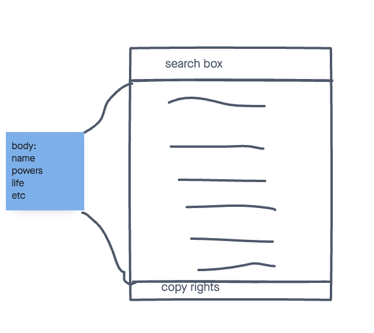
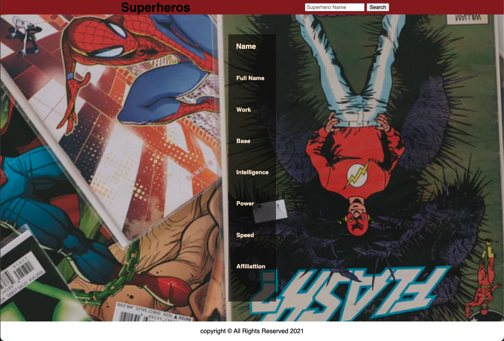

# Project 1

A simple web app that display Superheros

## technologies Used
- HTML5
- CSS3
- JS
- JQuery
- Superheros API(https://superheroapi.com/)
- Github Pages (for deployment)

## Screenshots

## Getting started
[click](https://project-superheros.netlify.app/) here to get started and see the app online! 

## Future Enhancements
-More information on the superheros
-flipping cards
-More Unique design
